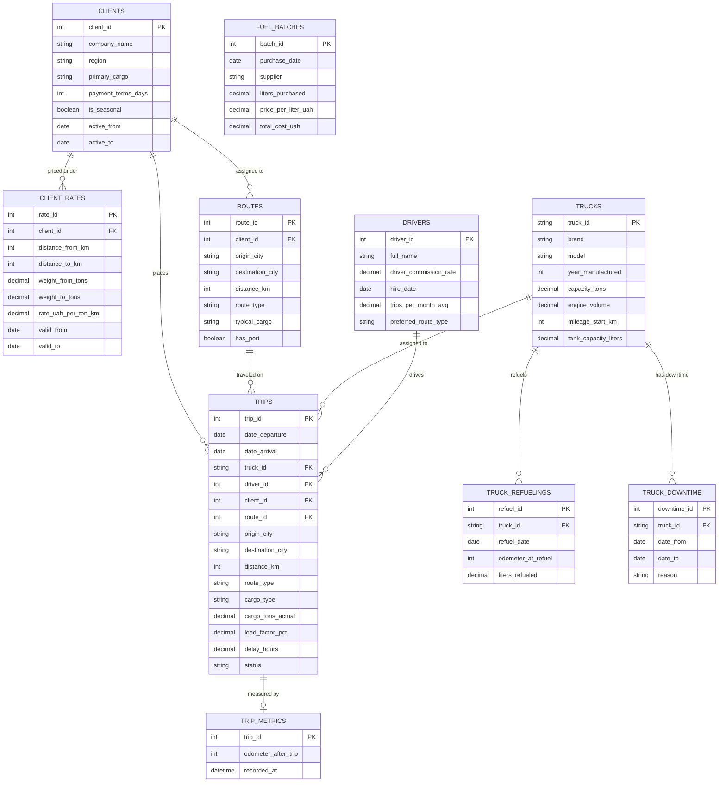

# 🚛 Ukrainian Freight Logistics Analytics

End-to-end analytics project exploring profitability, fuel costs, client performance, route economics, and truck-level efficiency in a Ukrainian B2B freight transportation company.

---

## Table of Contents

- [Project Overview](#project-overview)
- [Project Scope](#project-scope)
- [Business Questions](#business-questions)
- [Analysis by Business Question](#analysis-by-business-question)
- [Dataset](#dataset)
- [Data Model](#data-model)
- [Metric Logic](#metric-logic)
- [Data Quality](#data-quality)
- [Dashboard](#dashboard)
- [Tech Stack](#tech-stack)
- [Repository Structure](#repository-structure)
- [Key Insights](#key-insights)
- [Recommendations](#recommendations)

---

## Project Overview

This project analyzes the profitability of a Ukrainian B2B freight transportation company operating a fleet of 12 trucks between July 2022 and October 2024.

The company transports wheat, corn, sunflower, and soybeans across Ukraine.

During 2024, diesel prices rose sharply. Freight tariffs rose too, closely tracking fuel costs but not quite matching them — raising an open question about whether this threatened profit margins. (It didn't, fleet-wide — see Key Insights.)

The goal of this project is to identify which commercial and operational factors have the greatest impact on profitability and where management should focus improvement efforts.

## Project Scope

This project demonstrates an end-to-end analytics workflow:

- Business problem definition
- Synthetic dataset generation
- Relational database design
- SQL data validation
- KPI calculation
- Exploratory data analysis
- Tableau dashboard development
- Business recommendations

## Business Questions

- Which clients generate the highest profit — not just revenue — and what explains low-margin relationships?
- Did rising fuel prices threaten profitability, and is fuel-price exposure evenly distributed across clients and routes?
- Which routes underperform, and what operational factors explain why?
- Do truck-level factors explain remaining performance issues, and is profit concentrated across trucks the way it is across clients?

## Analysis by Business Question

| Business Question | Notebook | Summary |
|---|---|---|
| Business performance overview (context for the four questions below) | [`notebooks/04_business_overview.ipynb`](notebooks/04_business_overview.ipynb) | [`docs/03_business_overview_summary.md`](docs/03_business_overview_summary.md) |
| Which clients generate the highest profit rather than just revenue? | [`notebooks/05_client_profitability.ipynb`](notebooks/05_client_profitability.ipynb) | [`docs/04_client_profitability_summary.md`](docs/04_client_profitability_summary.md) |
| Did rising fuel prices threaten profitability? | [`notebooks/06_fuel_cost_impact.ipynb`](notebooks/06_fuel_cost_impact.ipynb) | [`docs/05_fuel_cost_summary.md`](docs/05_fuel_cost_summary.md) |
| Which routes underperform, and why? | [`notebooks/07_route_analysis.ipynb`](notebooks/07_route_analysis.ipynb) | [`docs/06_route_analysis_summary.md`](docs/06_route_analysis_summary.md) |
| Do truck-level factors explain remaining performance issues? | [`notebooks/08_truck_driver_performance.ipynb`](notebooks/08_truck_driver_performance.ipynb) | [`docs/07_truck_driver_performance_summary.md`](docs/07_truck_driver_performance_summary.md) |

A consolidated, priority-ranked action list synthesizing all four notebooks' recommendations — including two findings that only emerge when the notebooks are read together — is available in [`docs/08_business_recommendations_summary.md`](docs/08_business_recommendations_summary.md).

## Dataset

The project uses a synthetic but business-realistic dataset generated specifically for this portfolio project.

The dataset contains realistic operational constraints, client-specific pricing, seasonal demand patterns, truck downtime, and changing fuel prices.

Generator: [`python/generate_data.py`](python/generate_data.py)

**Period:**

- July 2022 – October 2024

## Data Model

The database consists of 10 relational tables.

*Note: `fuel_batches` has no direct foreign key to other tables in SQL — trips are matched against it via FIFO logic in Python (`06_fuel_cost_impact.ipynb`), not a database-level join.*

## Metric Logic

Financial metrics are not stored directly in the dataset and are calculated analytically.

**Key assumptions:**

- Revenue is calculated using Trips + Client Rates.
- Cancelled trips are excluded from revenue.
- Fuel costs are allocated per trip based on FIFO consumption of bulk fuel purchase batches, not current market diesel price.
- Gross Profit = Revenue − Allocated Fuel Cost.
- Delayed trips remain part of revenue but are analyzed separately.
- Trip-level profit represents an analytical estimate rather than an accounting value.

## Data Quality

The dataset was validated before performing profitability analysis.
All critical data quality issues were resolved before starting business analysis.

**Validation included:**

- Duplicate primary keys
- Missing values
- Referential integrity
- Business rule validation
- Tariff consistency
- Fuel consistency
- Route consistency

Detailed validation results are available in:

- [`notebooks/01_data_quality.ipynb`](notebooks/01_data_quality.ipynb)
- [`docs/02_data_quality_summary.md`](docs/02_data_quality_summary.md)
- [`sql/04_data_quality.sql`](sql/04_data_quality.sql)

## Dashboard

🔗 [View live dashboard on Tableau Public](https://public.tableau.com/app/profile/inna.myroshnichenko3475/viz/UkrainianFreightLogisticsAnalytics/BusinessOverview)

- Business Overview
- Client Profitability
- Fuel Cost Impact
- Route Efficiency Analysis (2024)
- Truck Performance (2024)

## Tech Stack

- SQL (MySQL)
- Python (Pandas, NumPy)
- Tableau
- Git
- GitHub

## Repository Structure

├── data/
│ ├── raw/ # Generated source CSVs
│ └── processed/ # Analysis outputs (client, route, fuel, truck risk tables)
├── sql/ # Database creation, constraints, and data quality validation
├── notebooks/ # Data quality, dataset build, and business question notebooks (01-08)
├── python/ # Synthetic dataset generator and fuel cost allocation logic
├── docs/ # Data quality report and per-notebook business summaries
├── tableau/ # Tableau workbook and dashboard assets
├── .env.example # Environment variables template
├── .gitignore
└── README.md

## Key Insights

- **Two clients drive the bulk of structural profitability risk, confirmed at both the client and route level.** ТОВ Полтавські Лани and ПП ДніпроЗерно pay below-market tariffs and carry delay concentrated on a single route each — the same risk, found independently twice ([`docs/04_client_profitability_summary.md`](docs/04_client_profitability_summary.md), [`docs/06_route_analysis_summary.md`](docs/06_route_analysis_summary.md)).
- **Rising fuel prices (+14%, 2022-2024) did not threaten business viability.** Company-wide margin held steady; seasonal demand swings, not fuel cost, drive most of the month-to-month performance variation ([`docs/05_fuel_cost_summary.md`](docs/05_fuel_cost_summary.md)).
- **Port-destination routes are a structurally distinct, and structurally underpriced, risk category** — lower tariffs and higher delays than the rest of the network — but the four routes don't all share the same root cause: one has an additional, cargo-mix-driven loading-efficiency problem the others don't ([`docs/06_route_analysis_summary.md`](docs/06_route_analysis_summary.md)).
- **Truck- and driver-level factors are not a meaningful driver of profitability.** Profit is far less concentrated across trucks (53%/top-5) than across clients (84%/top-5), and neither truck age, truck assignment, nor downtime explain the patterns found at the client and route level ([`docs/07_truck_driver_performance_summary.md`](docs/07_truck_driver_performance_summary.md)).

## Recommendations

Full, priority-ranked recommendations across all four business questions — including where two notebooks converge on the same risk and where a second, independent cause compounds a first — are consolidated in [`docs/08_business_recommendations_summary.md`](docs/08_business_recommendations_summary.md).

Highlights:

- Renegotiate tariffs on all four port routes — priced below the rest of the network as a category, not just two isolated client cases.
- Separately fix a cargo-mix-driven loading-efficiency issue on one specific port route, on top of the tariff fix above.
- Protect seasonal clients contractually against fuel-driven margin volatility.
- Deprioritize truck-level and route-type-based interventions — neither explains meaningful variance in this dataset.